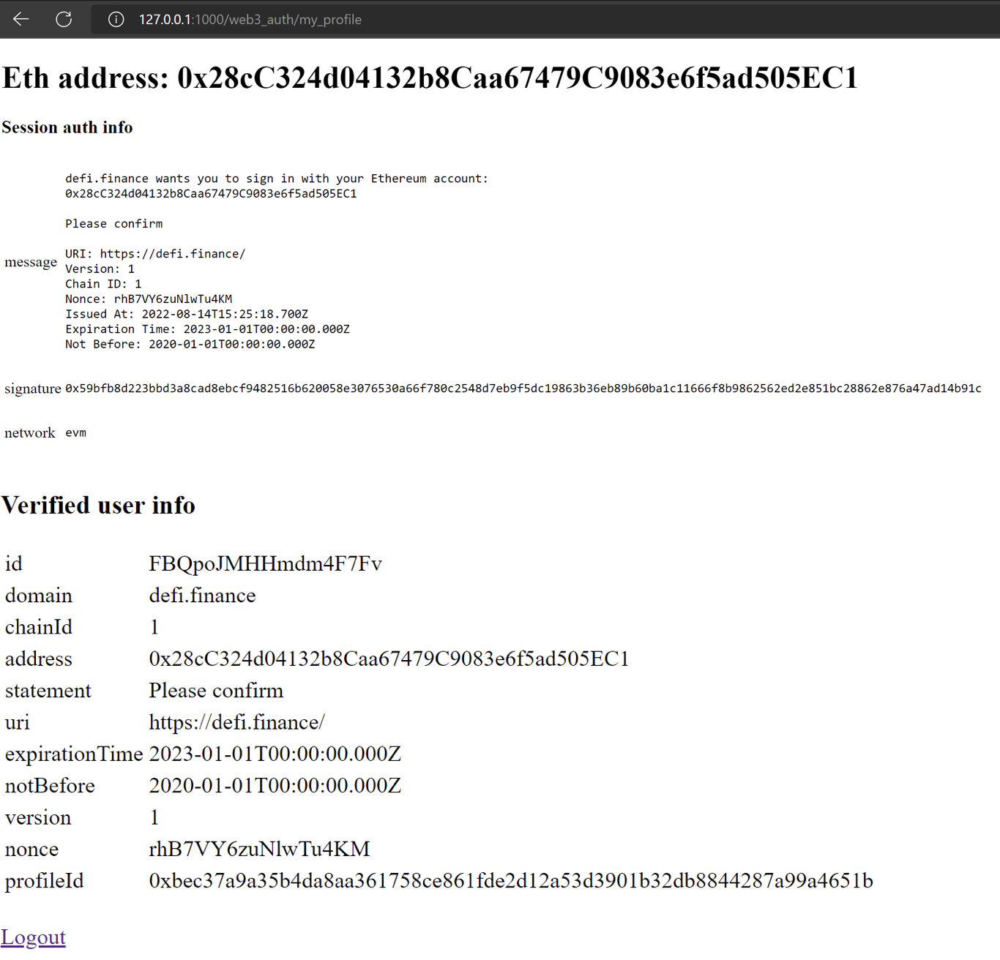

翻译自：https://moralis.io/how-to-add-metamask-authentication-with-django-in-5-steps/


# 如何在5个步骤中用 Django 添加 MetaMask 身份验证

本文将演示如何使用 Django 添加 MetaMask 身份验证。与此同时，我们将探讨如何仅用五个步骤搞定它。


这样做，我们将创建一个全栈 Django 应用程序，用户可以在其中登录并验证自己与他们的Web3钱包。


如果您不想阅读整个指南，而是直接跳入代码，请查看以下 GitHub 仓库：[使用 Django 文档完整添加 MetaMask 身份验证]( https://github.com/moralisweb3/demo-apps/tree/main/django_moralis_auth/web3_auth)


Web3身份验证是去中心化 Web 的基本机制。

而且，允许用户使用Web3钱包进行身份验证使企业服务更容易访问。


此外，它还提供了更加引人注目的用户体验。这表明，统一的标识同时对企业和消费者产生积极影响。

更多地，它还可以实现各种身份验证机制，其中一个流行的选择就是 MetaMask。


因此，由于 Web3身份验证是Web3开发的重要功能，而 MetaMask 是最流行的 Web3钱包之一，本文将重点讨论这个主题。


具体来说，我们将向您展示如何使用 Django 添加 MetaMask 身份验证！


附带地，为了支持更无缝的 Web3身份验证流，我们将使用 Moralis Auth API。


反过来，我们可以创建一个完整的 Django 应用程序，用户只需要五个简单的步骤就可以使用 MetaMask 进行身份验证。


但是，如果您更喜欢使用 NextJS，请参阅我们关于如何集成后端 Web3身份验证功能的指南！


因此，如果你想在未来的项目中添加身份验证机制，或者只是想成为一个区块链开发者，那么现在就注册 Moralis 吧。更重要的是，创建一个账号是免费的，您可以立即开发您的第一个项目！ 


不过，在继续之前，我们先复习一些基本知识。因此，我们从Django开始。之后，我们将深入研究代码！


## Django是什么

在继续学习关于如何使用 Django 添加 MetaMask 身份验证的教程之前，最好探索一下 Django 。因此，我们将在本节中解释什么是 Django，以及它如何帮助开发人员更快地构建项目。言归正传，我们来回答这个问题”Django是什么?“。


简而言之，Django 是 Python 的一个高级 web 框架。此外，该框架允许开发人员使用干净和实用的设计来构建项目。此外，Django 是由开发人员为开发人员构建的。因此，框架可以解决与 Web 开发相关的大部分繁重工作。因此，如果使用该框架，则可以将重点放在编写应用程序上。更重要的是，你可以避免重新发明轮子的需要。 


此外，Django 是完全免费和开源的，这里有一些框架的显著特性: 


- **高安全性**：Django 注重可靠性，帮助开发人员在开发网站或应用程序时保持高水平的安全性。因此，在使用 Django 时，可以避免一些常见的安全错误
- **快速**：由于开发人员希望项目快速进入市场，Django 设计了优先考虑速度的框架。
- **可伸缩性**：Django 提供了快速和灵活伸缩的机会。 


对 Django 有了更好的了解之后，我们可以继续讨论本文的主题。因此，我们将在五个步骤中演示如何使用 Django 添加 MetaMask 身份验证！ 


## 使用 Moralis 在5个步骤中使用 Django 添加 MetaMask 身份验证

在本教程中，我们将通过创建一个完整的 Django 应用程序来更仔细地研究 Moralis Web3身份验证的复杂性。

此外，应用程序用户将能够用他们的 Web3钱包登录并验证他们的 Web3身份。然后，一旦用户验证了他们自己，他们就可以查看关于自己的信息。

例如，它们可以看到ID、地址、链上ID等。


因此，为了说明最终的效果，这里有两个页面，分别是登录页面和用户页面


登录页:


用户页面：




如前所述，因为我们选择使用 Moralis，所以只需要五个简单的步骤就可以添加使用 Django 的 MetaMask 身份验证: 

1. 添加先决条件 
2. 安装依赖项
3. 创建 Django 项目和应用程序
4. 编辑“ moralis _ auth”设置
5. 创建“ web3 _ auth”应用程序和模板文件


因此，废话不多说，让我们直接进入第一步，在开始创建应用程序本身并使用 Django 添加 MetaMask 身份验证之前，了解一下我们需要考虑的必要先决条件！ 


### 步骤1-先决条件 

与任何教程一样，需要具备特定的先决条件。因此，对于本教程来说，如果您想要使用 Django 添加 MetaMask 身份验证，Moralis 帐户是第一个先决条件。因此，如果你还没有，我们建议你立即与道德家签约！此外，创建帐户是免费的，只需要几秒钟。 

此外，如果您有了 Moralis 帐户，那么第二个先决条件是 Python3。因此，如果您还没有它，那么您需要安装 Python3。在我们的示例中，我们使用 Python 3.10来演示这个过程。 

最后，我们建议您掌握有关 Django 的基本知识，以使本教程更易于理解。虽然它不是必需的，但是如果您想要在本教程中继续学习，那么您将从中受益。因此，您可以在这里查看官方文档，以了解有关 Django 的更多信息。 

这就是本教程的先决条件和第一步！因此，在所有准备工作都完成之后，我们可以进入指南的第二步，向您展示如何安装必要的依赖项。 

### 步骤2-安装依赖项

如果需要，首先需要创建一个虚拟环境。但是，为什么呢？简而言之，虚拟环境提供了几个好处，因为它们有自己的站点目录。此外，它们还可以与其他系统站点目录隔离。此外，这意味着它们可以拥有自己的包集。更重要的是，创建一个虚拟环境相对简单，您只需要以下命令: 

```shell
python3 -m venv django_web3_auth_env
```

有了这个虚拟环境，我们就可以继续了。为此，我们将安装各种依赖项。因此，必须安装“ django”和“ request”依赖项。在本教程中，我们使用了 Django version 3.1，您可以使用以下命令来安装这两个依赖项: 

```shell
django_web3_auth_env\Scripts>pip3.10.exe install django
django_web3_auth_env\Scripts>pip3.10.exe install requests
```

但是，请确保在以前创建的本地环境的特定脚本文件夹中执行这些命令。而且，这是在上面的命令中指定的，因为我们设置了到本地环境的路径。

因此，安装了这两个依赖项之后，本教程的第二步就完成了。因此，让我们继续来看看如何创建 Django 项目和应用程序！ 

### 步骤3-创建 Django 项目和应用程序

要启动第三步，必须创建一个 Django 项目。因此，要创建项目，可以使用以下命令: 

```shell
django_web3_auth_env\Scripts\django-admin startproject moralis_auth
```

运行此命令并建立项目后，您将能够在“ Scripts”文件夹中找到“ django-admin”，路径为“*django_web3_auth_env\Scripts\django-admin.exe*“. 

接下来，您还必须创建一个 Django 应用程序，要创建这个应用程序，请使用以下命令:

```
django_web3_auth_env\Scripts\python.exe manage.py startapp web3_auth
```

此外，确保“ web3 _ auth”位于与“ manage.py”相同的文件夹中。但是，如果前面的命令是在找到“ manager. py”的文件夹中运行的，那么这应该不是问题。此外，还需要运行数据库迁移。这是相对简单的，您可以使用以下命令: 

```shell
django_web3_auth_env\Scripts\python.exe manage.py migrate
```

